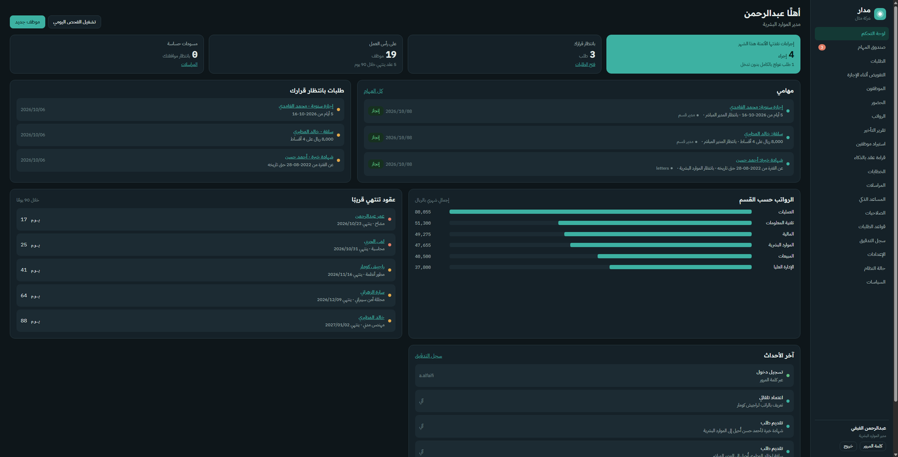
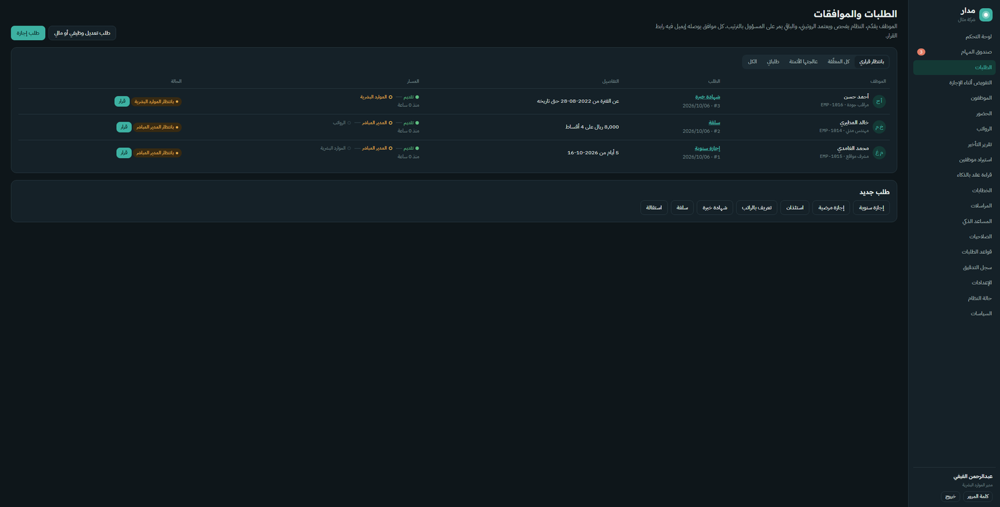
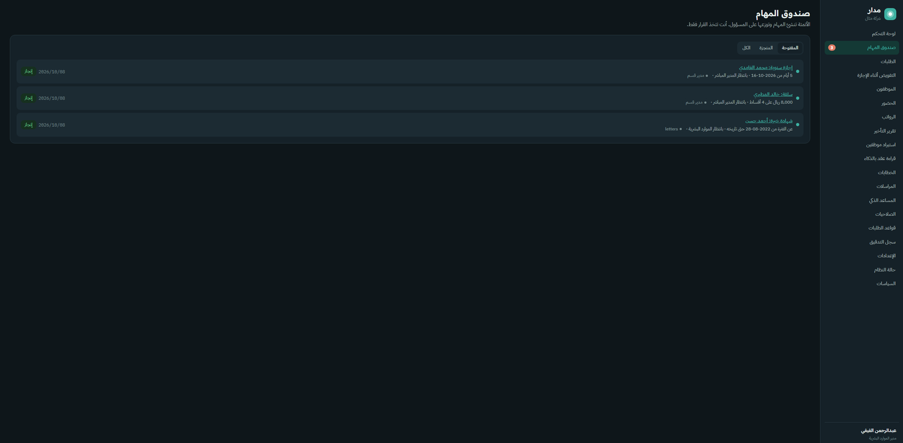
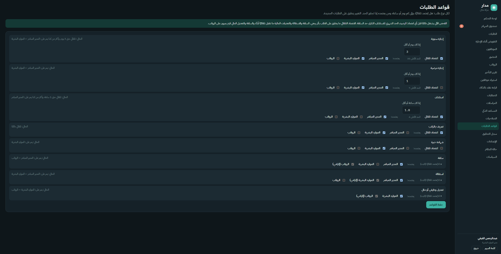

[العربية](README.ar.md)

# Madar | HR Automation Platform

A web-based HR platform that automates employee requests and approvals, payroll, attendance matching, and HR documents, built with security as a first-class requirement. It includes a permission-aware AI assistant.

> **Status:** in active development. Security controls are implemented and tested internally. The system has **not yet been externally penetration-tested**.

## What it does

| Area | Capabilities |
|---|---|
| Requests and approvals | Leave, permission, advance, resignation and other request types; automatic reminders and escalation when an approver is late; delegation while a manager is away |
| Payroll | Monthly payroll close with readiness checks; retroactive adjustments when a change is approved late; prorated salary for new hires; final settlement; wage-protection export (Excel/CSV) |
| Attendance | Fingerprint log import, automatic matching against leave and permission requests, absence alerts |
| Employees | Onboarding by form, Excel import, or contract reading; contract and residency expiry alerts; leave balance carry-over |
| Documents | Salary, experience, warning and termination letters; outbox of emails sent by the system |
| AI assistant | Answers questions using only what the signed-in user is allowed to see; disabled by default; never receives national ID or IBAN |

## Screenshots

The interface is Arabic (right-to-left). Screenshots use demo data generated by `flask --app wsgi seed`.

| | |
|---|---|
|  |  |
| **Dashboard:** pending decisions, tasks, expiring contracts, payroll by department | **Requests:** each request with its approval path and status |
|  |  |
| **Task inbox:** work the automation hands to a person | **Request rules:** who approves what, and which requests auto-approve |

## Security design

- **Server-side access control** on every route and every AI tool (hiding a button is never the only protection)
- **Separation of duties:** nobody approves their own request, a request they submitted, or two stages of the same request
- **Two-factor authentication (TOTP)** required for privileged roles; codes cannot be reused
- **Re-authentication** before sensitive actions such as changing permissions, exporting data, or terminating employment
- **Field-level encryption** of national ID and IBAN with a separate key
- **Rate limiting** on login, verification, activation, email links, and AI requests
- **Tamper-evident audit log:** each entry carries the hash of the previous one, and `verify-audit` detects edits or deletions
- **Hardened web layer:** CSRF protection, strict Content Security Policy, secure cookies, session timeouts, HTTPS via Caddy
- **Input validation** for every field (numbers, dates, IBAN checksum, file uploads with size and zip-bomb checks)
- The application refuses to start in production with weak keys or insecure settings

Details are in [SECURITY.md](SECURITY.md).

## Verification

- **88 automated tests** (security, integrity, workflow, automation): `pytest`
- **Bandit** static analysis: no high or medium findings
- **pip-audit** dependency scan: no known vulnerabilities
- External penetration test: **planned before first deployment**

## Tech stack

Python 3.12, Flask, SQLAlchemy, Alembic (Flask-Migrate), PostgreSQL (SQLite for local trials), Authlib (single sign-on), pyotp (TOTP), cryptography, openpyxl, pypdf, python-docx, Anthropic API (AI assistant), Gunicorn, Docker Compose, Caddy (automatic HTTPS), pytest.

## Quick start (local trial)

```bash
git clone https://github.com/Malhar24-cloud/madar.git
cd madar
python -m venv .venv
source .venv/bin/activate          # Windows: .venv\Scripts\activate
pip install -r requirements.txt
cp .env.example .env               # Windows: copy .env.example .env
                                   # set REQUIRE_2FA=false in .env for a local trial
flask --app wsgi seed              # demo company with sample employees and requests
flask --app wsgi run --debug       # http://127.0.0.1:5000
pytest                             # run the test suite
```

Production deployment uses `docker compose up -d` with real secrets in `.env` (never committed).

## License

Copyright (c) 2026 Majed Alharbi. All rights reserved. The source is published for review and portfolio purposes only; it may not be used, copied, or distributed without permission.
